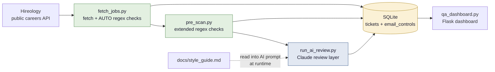

# Job-Posting QA

A two-layer quality-assurance tool for high-volume job postings. It pulls live
postings from Hireology's public careers API, runs each one through a **deterministic
regex layer** (for the mechanical defects) and a **Claude-powered review layer**
(for the judgment calls), and surfaces every issue in a Flask dashboard —
organized by location, severity, and check type. The point: turn *"someone
should really proofread these"* into a repeatable, auditable QA pass that can run
unattended every night.

Built for a senior-living employer that posts hundreds of roles across dozens of
communities, where postings quietly drift — copy-paste artifacts from Word,
missing required sections, off-brand tone, unfilled `[INSERT LOCATION]`
placeholders that ship to the public careers page. This catches them before a
candidate ever sees them.

> This is a **sanitized, fictional-brand** portfolio version of a real internal
> tool. Company and community names, branding, and all data are invented — see
> [*Inspired by*](#inspired-by) at the bottom.

---

## Architecture



Both layers write tickets to the same SQLite database, each tagged by who found
it (`AUTO` vs `CLAUDE`). The dashboard reads from there.

---

## How it works

The design rests on one decision: **split the checks by whether they need
judgment.** Mechanical, exactly-specifiable defects go to a fast, free,
deterministic layer; everything that needs reading comprehension goes to the AI.

**Layer 1 — deterministic rules** (`fetch_jobs.py`, `pre_scan.py`). Regex and
structural checks with no API cost, run on every posting. Because these defects
are exact patterns, a rule catches them every time and never hallucinates.

> *Example:* an unfilled template placeholder like `[INSERT LOCATION]` is a
> literal bracket pattern. A regex flags it as `CRITICAL` — no model required.

**Layer 2 — AI judgment** (`run_ai_review.py`). For the checks that need to
understand the posting, the tool calls the Claude API. The style guide
(`docs/style_guide.md`) is read into the system prompt at runtime, so editing the
guide changes what the model flags — no code change.

> *Example:* a Caregiver posting whose Responsibilities say *"Monitors each
> patient's well-being"* while the rest of the posting says *"residents."* In a
> senior-living context that's a terminology slip worth flagging — but deciding
> that requires understanding the care model, not matching a word. That's the
> AI's job (`Tone / Resident/Patient Mix`).

Before the AI runs, the deterministic layer hands it a brief of what it already
caught, so the two layers never double-flag the same issue. Every finding is
classified by **Category** (Tone / Content / Formatting / Structure), **Issue
Type**, and **Section**, then routed against a registry of known checks
(`email_controls`) so unrecognized findings can't silently pile up. See
[`SKILL.md`](SKILL.md) for the full pipeline and [`CLAUDE.md`](CLAUDE.md) for the
data model and DB-safety rules.

---

## Running it locally

```bash
# 1. Clone
git clone https://github.com/yourname/job-posting-qa-portfolio.git
cd job-posting-qa-portfolio

# 2. Virtual environment + dependencies
python -m venv venv
venv\Scripts\activate          # Windows
# source venv/bin/activate     # macOS / Linux
pip install -r requirements.txt

# 3. Configure (optional for the demo)
copy .env.example .env          # Windows  (cp on macOS/Linux)
# Set SESSION_SECRET_KEY + BOOTSTRAP_ADMIN_* for login.
# Set ANTHROPIC_API_KEY only if you want to run the live AI layer —
# the demo and the deterministic layer work without it.

# 4. Build the demo database (synthetic postings, no API needed)
python seed_demo_data.py --include-ai-examples

# 5. Run
python qa_dashboard.py          # http://localhost:5000
```

`seed_demo_data.py` runs the Alembic migration to create a fresh SQLite
database, parses the bundled synthetic `jobs_raw.json` (five fictional postings
with QA issues spread deliberately across them), runs the deterministic AUTO
layer over them, and — with `--include-ai-examples` — adds a few hand-written
sample tickets from the AI layer so the dashboard is fully populated **without an
API key**. The result: a dashboard lit up across every check category, plus one
clean "control" posting that produces zero tickets.

On first launch the app seeds an admin account from your `BOOTSTRAP_ADMIN_*`
values; log in with those.

---

## Deploying

The repo ships a production container and a Fly.io config as a worked example —
not required to run the demo, but they show the deployment story.

```bash
# Local container (sqlite profile, mirrors the Fly deploy)
docker compose up                  # builds the image, serves on :5000

# Fly.io: one-time `flyctl launch --no-deploy`, create a volume + set secrets, then
flyctl deploy
```

`entrypoint.sh` runs `alembic upgrade head` and then starts gunicorn; `/healthz`
backs the container healthcheck. `.github/workflows/fly-deploy.yml` is an
example auto-deploy-on-push workflow.

## Tech stack

- **Python 3.13 / Flask** — web app, API endpoints, server-rendered Jinja templates
- **SQLite** — ticket store, accessed through a safe copy-on-write layer
- **SQLAlchemy + Alembic** — engine abstraction and schema migrations (Postgres-ready)
- **Anthropic Claude API** — the AI review layer (streaming + batch modes)
- **Docker** — `python:3.13-slim` image, non-root runtime, `/healthz` healthcheck
- **Fly.io / gunicorn** — example production deploy (auto-deploy workflow included)

---

## What I'd build next

- **Postgres runtime cutover.** Alembic migrations already run on Postgres via
  the SQLAlchemy engine; the remaining work is translating the runtime queries
  off the SQLite dialect so the app can scale past a single-writer SQLite file.
- **Configurable per-tenant rule packs.** Today the style guide and check set are
  one brand's. Making the style guide, brand boilerplate markers, and enabled
  checks configurable per employer would turn this into a multi-tenant product.
- **Multi-language postings.** Detect posting language and run a
  language-appropriate style guide so bilingual markets are covered.
- **Scheduled ingestion + alerting.** Nightly fetch + review on a cron, with a
  digest of new criticals pushed to the recruiting team.
- **Reviewer feedback loop.** Use accept/reject decisions on AI findings to tune
  the prompt and retire noisy checks automatically.

---

## Inspired by

This is a sanitized portfolio version of a real internal tool I built to QA live
job postings for a senior-living operator. The architecture and product thinking
are real; the company, communities, branding, and all data here are fictional.
